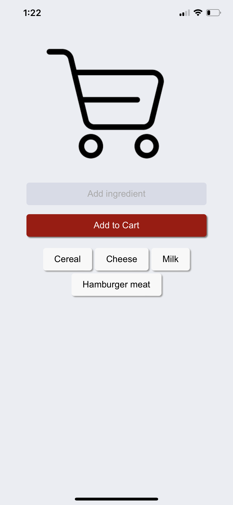

# Shopping Cart

> A shopping cart app that allows you to enter ingredients and adds them to a cart for easy reference while at the store. You can also remove ingredients from the cart when you have obtained them. 

[Shopping Cart](https://finstacart.netlify.app/)
Deployed Link: https://finstacart.netlify.app/

## Table of Contents
* [General Info](#general-information)
* [Technologies Used](#technologies-used)
* [Features](#features)
* [Screenshots](#screenshots)
* [Setup](#setup)
* [Usage](#usage)
* [Project Status](#project-status)
* [Room for Improvement](#room-for-improvement)
* [Acknowledgements](#acknowledgements)
* [Contact](#contact)

## General Information
The shopping cart app is designed to solve the problem of forgetting ingredients while grocery shopping. It provides a simple interface where users can enter ingredients they need to purchase, and the app will store them in a cart for easy access. Users can mark off ingredients as they obtain them, removing them from the cart.

The purpose of the project is to streamline the shopping experience and ensure that all necessary ingredients are remembered and obtained. The app aims to save time and prevent the frustration of forgetting items.

The project was undertaken to practice web development skills and create a practical tool that can benefit users in their daily lives.

## Technologies Used
- HTML
- CSS
- JavaScript
- Firebase

## Features
- Add ingredients to the shopping cart
- Remove ingredients from the shopping cart
- Mark ingredients as obtained

## Screenshots
<!-- Add screenshots if available -->

## Usage
1. Open the shopping cart app in your web browser.
2. Enter the ingredients you need to purchase in the provided input field.
3. Press the "Add" button to add the ingredient to the shopping cart.
4. To mark an ingredient as obtained, click on the ingredient in the shopping cart.
5. To remove an ingredient from the cart, click on the delete icon next to the ingredient.

## Project Status
The project is complete and fully functional.

## Room for Improvement
- Add OpenAI API to help come up with meal prep ideas to give you ingredients for your shopping cart
- Implement user authentication to allow multiple users to have their own shopping carts.
- Enhance the user interface with more visual elements and styling options.
- Add the ability to categorize ingredients or create multiple shopping lists.

## Acknowledgements
- This project was inspired by my wife and her need for an efficient shopping cart app.
- The project utilized various online resources and tutorials related to web development and Firebase.

## Contact
Created by @Nam3loc on GitHub - feel free to contact me!